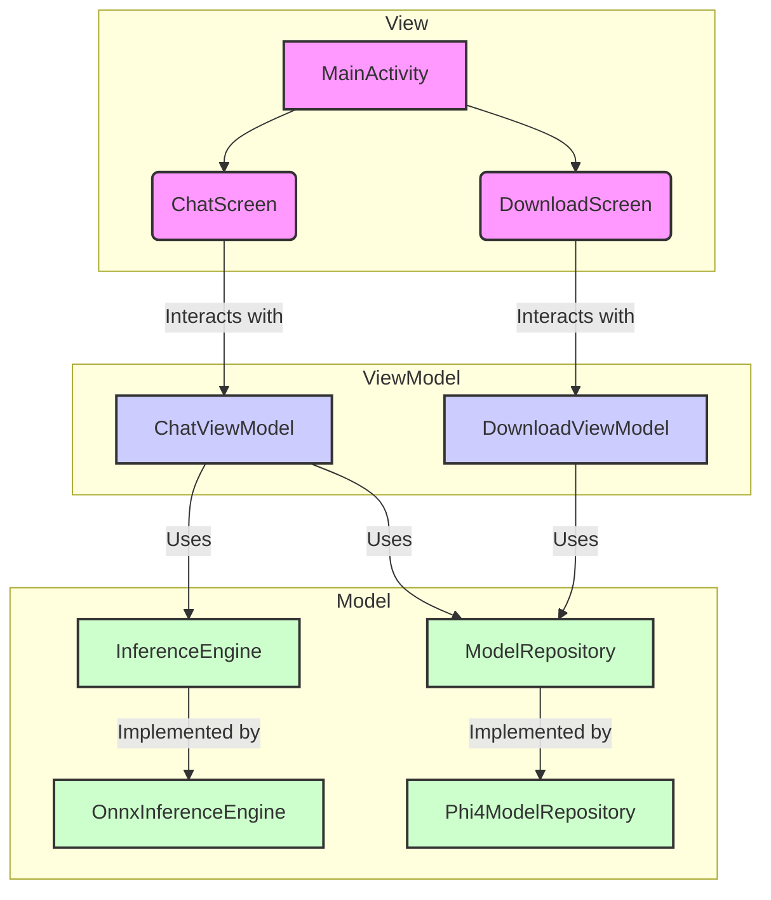

# LocalAssistant Architecture

This document outlines the architecture of the LocalAssistant Android application.

## Overview

The application follows the **Model-View-ViewModel (MVVM)** architectural pattern. This pattern separates the application into three main components, promoting a clean and maintainable codebase.

*   **View:** The UI layer of the application, responsible for displaying data and capturing user input.
*   **ViewModel:** Acts as a bridge between the View and the Model. It holds the UI state and exposes it to the View, and it handles user interactions.
*   **Model:** The data and business logic layer of the application. It's responsible for managing data, whether from a local database, a network source, or, in this case, the LLM inference engine.

## Component Diagram

The following diagram illustrates the relationship between the different components of the app:

## Component Breakdown

### View (`ui` package)

*   **`MainActivity.kt`**: The main entry point of the application. It observes the `DownloadViewModel` to decide whether to show the `DownloadScreen` or the `ChatScreen`. It is also responsible for manual dependency injection.
*   **`ChatScreen.kt`**: A Composable function that displays the chat interface. It observes the `ChatViewModel` for the chat history and other state updates. It also sends user events (like sending a message) to the `ChatViewModel`.
*   **`DownloadScreen.kt`**: A Composable function that displays the model download progress. It observes the `DownloadViewModel` for download status and progress updates.

### ViewModel (`viewmodel` package)

*   **`ChatViewModel.kt`**: Manages the state for the `ChatScreen`. It interacts with the `InferenceEngine` to get responses from the LLM and with the `ModelRepository` to manage the model. It exposes the chat history and other UI-related state to the `ChatScreen`.
*   **`DownloadViewModel.kt`**: Manages the state for the `DownloadScreen`. It uses the `ModelRepository` to download the LLM model and exposes the download progress and status to the `DownloadScreen`.

### Model (`data`, `engine`, `inference` packages)

*   **`ModelRepository` (`data` package)**: An interface that defines the contract for managing the LLM model (e.g., downloading, checking for existence).
*   **`Phi4ModelRepository.kt` (`data` package)**: The concrete implementation of the `ModelRepository`.
*   **`InferenceEngine` (`engine` package)**: An interface that defines the contract for the LLM inference. It takes the chat history and a new message and returns a response from the model.
*   **`OnnxInferenceEngine.kt` (`inference` package)**: The concrete implementation of the `InferenceEngine` using the ONNX runtime.
*   **`model` package**: Contains data classes (e.g., `Message.kt`) that represent the data structures used throughout the application.

## Data Flow

1.  The **View** (e.g., `ChatScreen`) captures a user action (e.g., sending a message).
2.  The **View** calls a corresponding function in the **ViewModel** (e.g., `ChatViewModel.sendMessage()`).
3.  The **ViewModel** processes the action, which may involve interacting with the **Model** layer (e.g., calling `InferenceEngine.generateResponse()`).
4.  The **Model** performs the required business logic (e.g., running the LLM inference) and returns the result to the **ViewModel**.
5.  The **ViewModel** updates its state with the new data.
6.  The **View**, which is observing the **ViewModel's** state, automatically recomposes to display the updated information.
