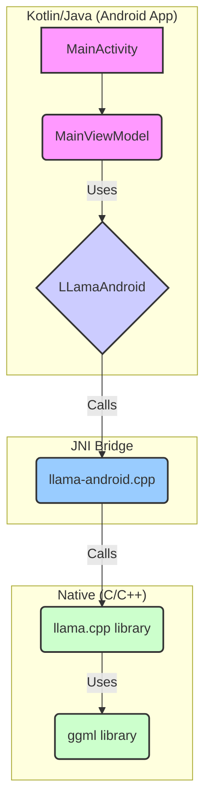

# Llama.cpp Android Integration

This document outlines the architecture of the `llama.cpp` Android example and how it integrates the native `llama.cpp` library into an Android application. This understanding is crucial for integrating `llama.cpp` as a new inference engine into the `LocalAssistant` project.

## Overview

The `llama.cpp` Android example is a standalone Android project that demonstrates how to use the `llama.cpp` library for inference on an Android device. It uses a JNI (Java Native Interface) bridge to communicate between the Kotlin/Java application code and the native C/C++ `llama.cpp` code.

## Project Structure

The project is divided into two main modules:

*   **:app**: The main Android application module, containing the UI and ViewModel.
*   **:llama**: An Android library module that encapsulates the `llama.cpp` native code and the JNI bridge.

## Architecture Diagram



## Component Breakdown

### 1. Android Application (`:app` module)

*   **`MainActivity.kt` / `MainViewModel.kt`**: Standard Android components that manage the UI and application state.
*   They interact with a singleton instance of the `LLamaAndroid` class to perform actions like loading a model and generating text.

### 2. JNI Wrapper (`:llama` module - Kotlin)

*   **`LLamaAndroid.kt`**: This is the primary interface for the Android app to interact with the native library.
    *   It's a singleton class to ensure only one instance of the Llama model is loaded.
    *   It uses a dedicated single-thread `CoroutineDispatcher` (`runLoop`) to ensure all native calls are executed sequentially on a background thread, preventing UI freezes and race conditions.
    *   It defines `external` functions (e.g., `load_model`, `new_context`, `completion_loop`) that map directly to the JNI functions in the C++ code.
    *   It manages the state of the loaded model, holding pointers to the native `llama_model` and `llama_context` as `Long` values.

### 3. JNI Bridge (`:llama` module - C++)

*   **`llama-android.cpp`**: This is the C++ implementation of the JNI bridge.
    *   It contains the actual implementations of the `external` functions defined in `LLamaAndroid.kt`.
    *   The function names follow the JNI naming convention: `Java_<package_name>_<class_name>_<function_name>`.
    *   These functions act as a thin wrapper, converting Java data types (like `jstring`) to C++ types and then calling the appropriate functions from the `llama.cpp` library (e.g., `llama_model_load_from_file`, `llama_decode`).
    *   It also handles logging by redirecting `llama.cpp`'s logs to Android's `logcat`.

### 4. Native Library (`llama.cpp`)

*   The core `llama.cpp` and `ggml` source files are included directly in the build process.
*   The `CMakeLists.txt` file is responsible for compiling these C/C++ files into a shared library (`libllama-android.so`) that gets packaged with the Android APK.

## Build & Integration Process (Submodule Strategy)

The recommended way to integrate `llama.cpp` is by using a **git submodule**. This approach avoids copying code directly and makes it easy to pull in future updates from the upstream `llama.cpp` repository.

1.  **Add Git Submodule**: Add the `llama.cpp` repository as a git submodule within the `LocalAssistant` project. This is typically done from the command line:
    ```bash
    git submodule add https://github.com/ggerganov/llama.cpp.git llama_cpp
    ```
    This will clone the `llama.cpp` repository into a `llama_cpp` directory.

2.  **Gradle Configuration (`settings.gradle.kts`)**: Instead of copying the `:llama` module, include it directly from the submodule's path. This requires telling Gradle where to find the module.

    ```kotlin
    // in settings.gradle.kts
    include(":llama")
    project(":llama").projectDir = file("llama_cpp/examples/llama.android/llama")
    ```

3.  **CMake Path Adjustment**: The `CMakeLists.txt` within the `:llama` module (`llama_cpp/examples/llama.android/llama/src/main/cpp/CMakeLists.txt`) is already configured with a relative path to find the main `llama.cpp` source code. Because we are preserving the directory structure via the submodule, this should work without modification.

4.  **Library Linking**: The existing CMake configuration will compile the `llama.cpp` source and link it against the `llama-android.cpp` JNI wrapper, creating the `libllama-android.so` shared library.

5.  **Loading in App**: The `LLamaAndroid.kt` class loads this shared library using `System.loadLibrary("llama-android")`. This part of the process remains unchanged.

## Key Takeaways for Integration

*   Use a **git submodule** to include `llama.cpp` for better maintainability.
*   Configure `settings.gradle.kts` to point to the `:llama` module within the submodule directory.
*   The `:llama` module from the `llama.cpp` example is a self-contained library.
*   The `LLamaAndroid.kt` class provides the high-level API for interacting with the native code.
*   A new `InferenceEngine` implementation will need to be created that wraps the `LLamaAndroid` class to adapt it to the existing `LocalAssistant` architecture.
